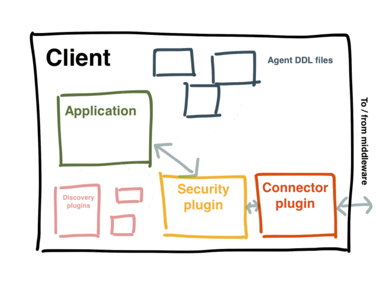

!SLIDE[bg=bpug_bg.png] center

# The MCollective Client #

~~~SECTION:notes~~~
* The most common client is the mco command-line client.
* Custom clients (from within applications eg.  life management PE)
* Only on nodes wher request will be initiated to the network

* Uses several kinds of plugin: (must match the servers plugins)
  * A connector plugin to connect to the middleware and send requests (and subscribe to replies)
  * A security plugin to validate and filter those requests (and encode replies)
I * Several agent plugin DDL files for constructing valid requests

As mentioned above, servers use agent plugins to execute actions.
Since clients request these actions, they need to know which actions are available and what kinds of arguments they require. To do this, they use the DDL file from each agent they care about.
These files describe actions and their inputs to enable early validation, and also tell the client how to format and summarize responses for the user.

* Optionally client plugins:
  * Extra discovery plugins to get lists of which server nodes will respond to a request
    (The default discovery method uses empty MCollective messages to find nodes, and querying a central database can sometimes be faster.)
  * Validator and aggregate plugins for checking and formatting data (These can be referenced by the agent DDL files.)
  * Application plugins to add custom subcommands to the mco command
~~~ENDSECTION~~~
