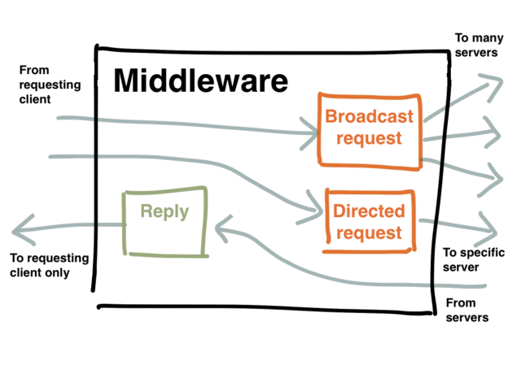

!SLIDE[bg=bpug_bg.png] center

# Inside The MCollective Middleware #

~~~SECTION:notes~~~
The connector and middleware handle three main kinds of messages:

  * Broadcast requests (client-to-server)
  * Directed requests (client-to-server)
  * Replies (server-to-client)

~~~ENDSECTION~~~
