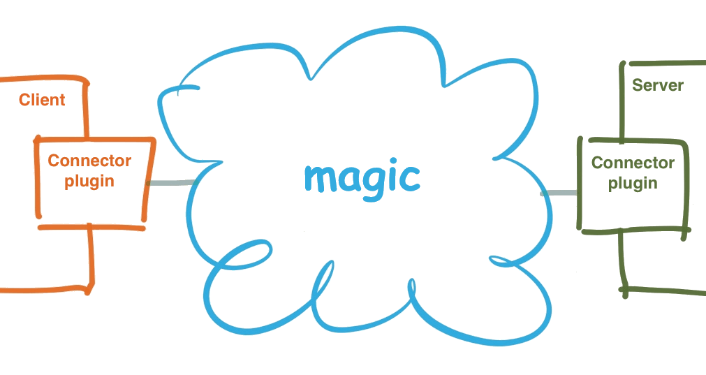

!SLIDE[bg=bpug_bg.png] center

# MCollective Middleware Overview #

~~~SECTION:notes~~~
MCollective clients and servers don’t communicate directly: they expect to be connected to some middleware system that knows how to route messages. They then publish messages to the middleware, and subscribe to messages they are interested in.

This middleware system is external to MCollective, and everything that interacts directly with it is pushed out into a connector plugin
~~~ENDSECTION~~~
