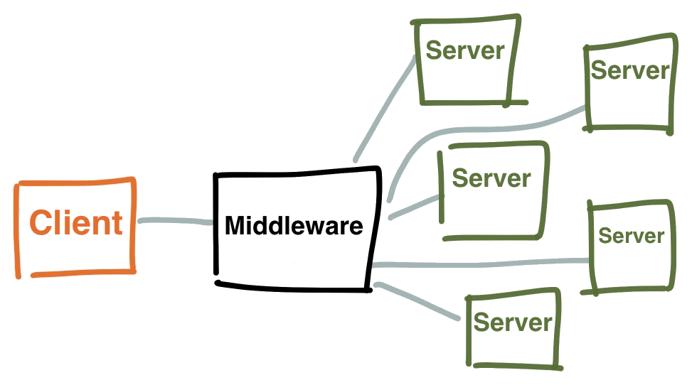

!SLIDE[bg=bpug_bg.png] center

# Overview - Components #

~~~SECTION:notes~~~
When talking about server, client, agent in the context of MCollective,
this is totally different than we are used, coming from the puppet world:

* Server : Initiates connections ans subscribes to the messages they care about
* Agent  : Bundel of actions distributes as a plugin
* Client : A system that sends request messages, and processes the responses

~~~ENDSECTION~~~
