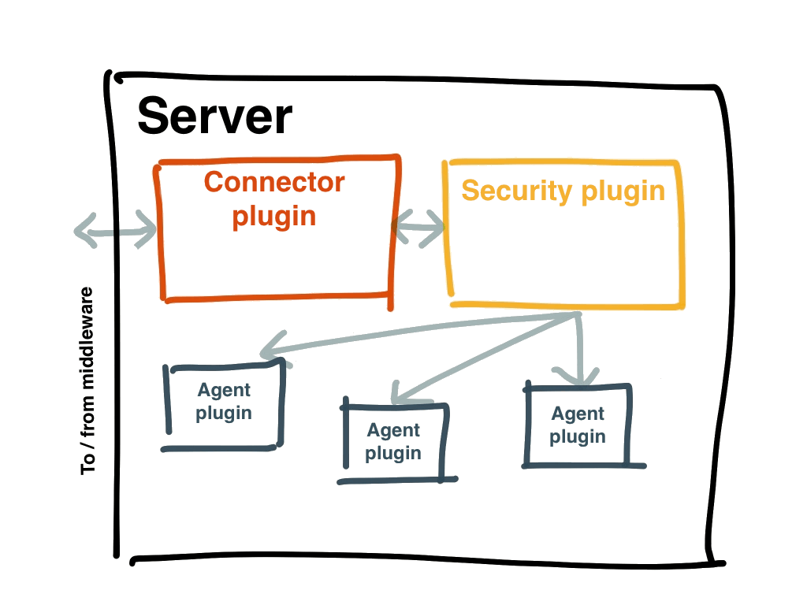

!SLIDE[bg=bpug_bg.png] center

# The MCollective Server -  mcollectived #

~~~SECTION:notes~~~
The mcollectived service uses several kinds of plugin:

* Mandatory plugins
  * A connector plugin to connect to the middleware and poll it for requests (and send replies)
  * A security plugin to validate and filter those requests (and encode replies)
  * Several agent plugins to execute actions from requests

* optional Plugins
  * A registration plugin to send a heartbeat and metadata to some kind of inventory database
  * Data plugins to enable more complicated request filtering
  * An authorization plugin to authorize requests on a per-action basis
  * An audit plugin to log all requests, centrally or locally
~~~ENDSECTION~~~
